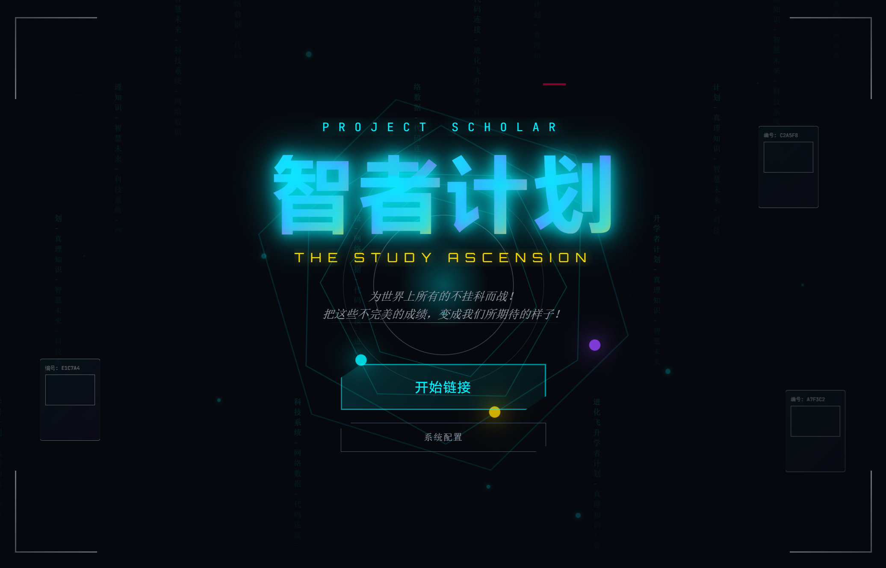

<h1 align="center">
  Project Scholar: The Study Ascension
  <br>
  智者计划：学习飞升
</h1>

<p align="center">
  <strong> 在期末的终焉凝视下，知识是我们唯一的救赎。</strong>
</p>

<p align="center">
  <strong> In the gaze of the Final’s End, knowledge is our only redemption.</strong>
</p>

<p align="center">
  
  
  
  
  
  
  
</p>

---

## 🚀 核心愿景 (Grand Vision)

### “复习，是人类面对遗忘时最后的反叛。”

#### 将枯燥的 **期末复习** 升华为一场对抗宇宙热寂的逻辑战争。玩家不再是在机械地“背书”，而是在现实崩塌的边缘，从虚空中 **“抢救”** 被认知熵抹除的文明火种。在这里，每一个知识点都是你手中的“真理之钥”，每一次正确的解题都是对谬误的 **“终极裁决”**，每一次失败都是对错误的 **“终极审判”**。

**Project Scholar** 不仅仅是一个复习软件，它是一场对抗抵挡考试侵蚀的逻辑战争。

宇宙的本质是一个巨大的运行程序。每隔一个学期纪元，被称为 **“大过滤器 (The Great Filter)”** 的灾难就会降临。它会将文明的知识解构为无意义的测试，将人类的记忆格式化。

你是 **“第 13 纪元”** 的最后一位 **英桀 (Hero)**，代号 **“首席智者 (The Observer)”**。你必须指挥由纯粹理性构建的 **“逻辑构造体”**，利用 **“真理之钥”** 抵挡考试的侵蚀，阻止万物归零。

---

<p align="center">
  
</p>

---

## 🛠️ 技术架构

| 模块         | 技术栈                                 | 说明               |
| ------------ | -------------------------------------- | ------------------ |
| **核心框架** | React 19 + TypeScript                  | 严格类型安全       |
| **构建工具** | Vite                                   | 极速热更新         |
| **样式引擎** | Tailwind CSS v4                        | 原子化 FUI 设计    |
| **动画引擎** | Framer Motion                          | 故障特效与转场     |
| **状态管理** | Zustand                                | 全局游戏状态       |
| **桌面封装** | Electron                               | 跨平台运行         |
| **AI 驱动**  | 多模型支持 (Gemini, OpenAI Compatible) | 动态生成题目与敌人 |

---

## 📂 项目结构目录

```plaintext
ScholarGame/
├── electron/               # Electron 主进程相关代码
│   ├── providers/          # AI 模型提供商适配器集合
│   │   ├── base-provider.cjs           # AI 提供商基类
│   │   ├── error-codes.cjs             # 错误代码定义
│   │   ├── gemini-provider.cjs         # Google Gemini 适配器
│   │   ├── openai-compatible-provider.cjs # OpenAI 兼容适配器
│   │   ├── provider-factory.cjs        # 提供商工厂模式实现
│   │   └── provider-registry.cjs       # 提供商注册表
│   ├── ai-service.cjs      # 统一 AI 服务层，管理多模型适配器
│   ├── main.cjs            # Electron 主入口，负责窗口创建与系统交互
│   └── preload.cjs         # 预加载脚本，实现主进程与渲染进程的安全通信
├── public/                 # 公共静态文件
├── src/                    # React 渲染进程源代码
│   ├── assets/             # 静态资源文件（图片、字体等）
│   ├── components/         # UI 组件库（遵循原子化设计原则）
│   │   ├── common/         # 通用组件（如自定义弹窗等）
│   │   ├── molecules/      # 分子组件（由原子组成的简单功能模块）
│   │   ├── organisms/      # 组织组件（复杂的区块级组件）
│   │   └── screens/        # 页面级组件（对应游戏的主要场景）
│   │       ├── CausalityRecord.tsx     # 历史记录/战绩回顾界面
│   │       ├── GrandUnificationSim.tsx # 关卡选择/星图导航界面
│   │       ├── MindHack.tsx            # 核心战斗/答题界面
│   │       ├── SettingsScreen.tsx      # 系统设置界面
│   │       └── TitleScreen.tsx         # 游戏标题界面
│   ├── hooks/              # 自定义 React Hooks（逻辑复用）
│   │   ├── useAI.ts            # AI 相关逻辑钩子
│   │   ├── useBattleSequence.ts # 战斗流程控制钩子
│   │   └── useGemini.ts        # Gemini 特定逻辑钩子
│   ├── lib/                # 工具函数与通用库
│   │   ├── constants.ts        # 游戏常量定义
│   │   └── utils.ts            # 通用工具函数
│   ├── stores/             # Zustand 全局状态管理
│   │   └── useGameStore.ts     # 游戏核心状态存储
│   ├── types/              # TypeScript 类型定义文件
│   │   ├── electron.ts         # Electron IPC 类型定义
│   │   └── game.ts             # 游戏核心类型定义
│   ├── App.tsx             # 应用根组件，处理路由与布局
│   ├── index.css           # 全局样式与 Tailwind 配置
│   └── main.tsx            # React 入口文件
├── .gitignore              # Git 忽略配置
├── package.json            # 项目依赖与脚本配置
├── tsconfig.json           # TypeScript 编译配置
├── vite.config.ts          # Vite 构建配置
├── 开发模式下添加新大模型指南.md # 开发文档：添加新模型指南
├── 游戏数值机制一览.md      # 游戏数值与机制详解
└── 游戏设计原稿.md          # 游戏设计文档
```

---

## ⚡ 启动指南

### 1. 安装依赖

```bash
npm install
```

### 2. 启动开发环境

```bash
npm run electron:dev
```

_注：AI 生成功能需在 Electron 环境下配置 API Key 使用。_

---

## 📄 许可证

本项目采用 **AGPL-3.0** 许可证。

Copyright © 2026 [yeflyleaf](https://github.com/yeflyleaf). All Rights Reserved.

---

<p align="center">
  <strong>英桀，请下令。为了让理性的光辉再次照亮这片虚空，出击！</strong>
</p>

<p align="center">
  <strong>Fight for all the 'Pass' in the world !</strong>
</p>

<p align="center">
  <strong>为世界上所有的不挂科而战 !</strong>
</p>
